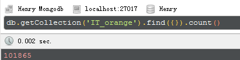
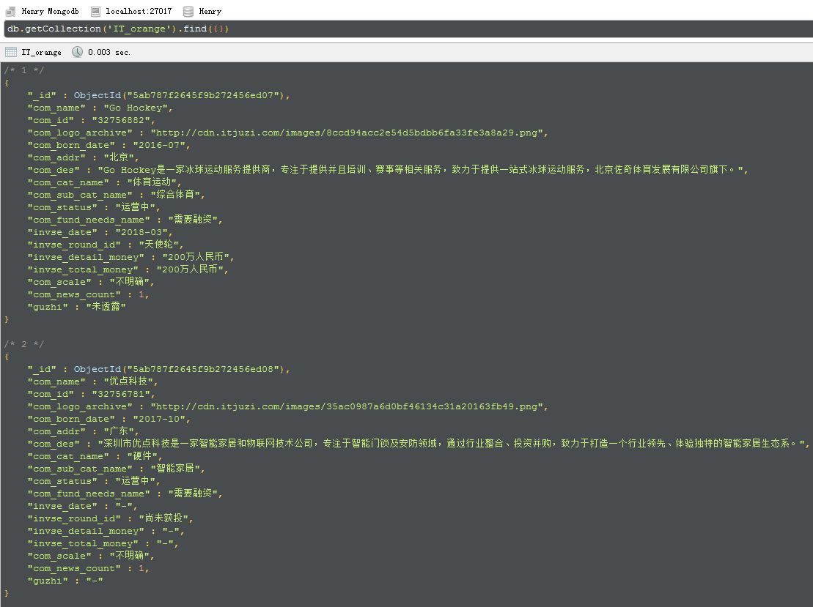

多进程爬取IT桔子网站的10万+公司信息 
===========================
    
### IT桔子官网 - https://www.itjuzi.com/
|Author|:sunglasses:Henryhaohao:sunglasses:|
|---|---
|Email|:hearts:1073064953@qq.com:hearts:

    
****
## :dolphin:声
### 软件均仅用于学习交流，请勿用于任何商业用途！感谢大家！
## :dolphin:介绍
- 项目介绍:该项目为爬取[IT桔子](https://www.itjuzi.com/)10万+公司信息
- 爬取内容:通过IT雷达中国公司信息展示平台，爬取了101865家公司信息（包括公司名、logo、城市、上市情况、融资情况等）
- 爬取方式:我爬取时刚注册赠送了会员,可以查看后面页数的公司信息,而目前由于IT雷达需要会员注册方可查看后面页数的公司,所以此代码需带入会员的登录cookie才可行
- 运行方法: 直接运行Spider目录下的main.py即可
- 数据截图:
    - 
    
    - 
## :dolphin:运行环境
Version: Python3
## :dolphin:存储数据库
MongoDB
## :dolphin:安装依赖库
```
pip3 install -r requirements.txt
```
